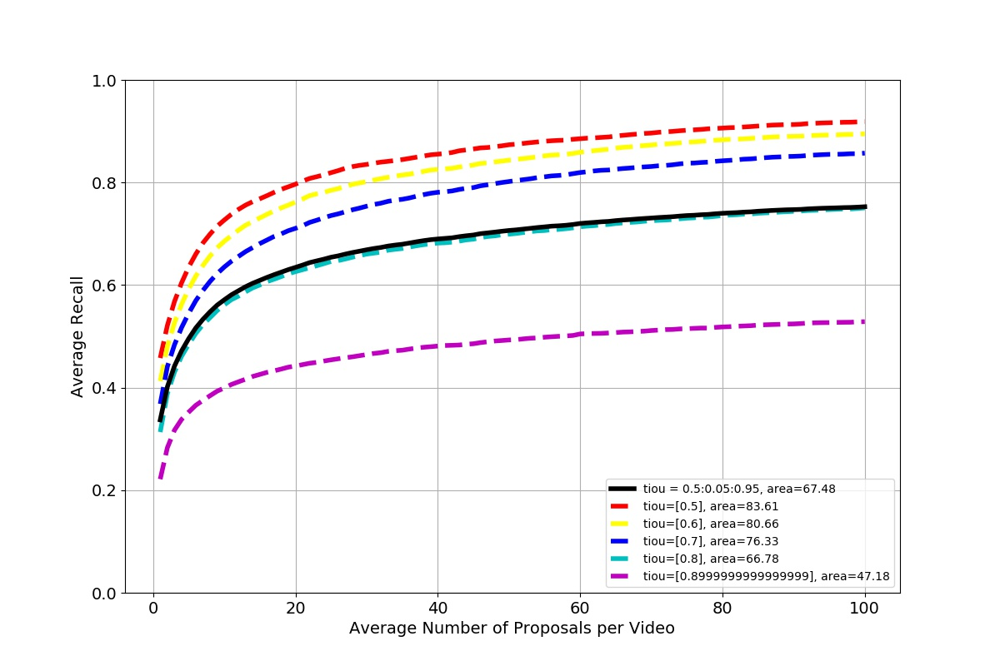

# BMN: Boundary-Matching Network

A pytorch-version implementation codes of paper:
 "BMN: Boundary-Matching Network for Temporal Action Proposal Generation",
  which is accepted in ICCV 2019. 

[[Arxiv Preprint]](https://arxiv.org/abs/1907.09702)

## Result
__Update(2020-06-19)__:  improved the pefermance. The new model can be download [here](https://pan.baidu.com/s/1ctIV83-Oz9P3jWD1iYnR2g). 提取码：nk3h

__Update(2019-10-17)__: 
I update the pytorch BMN codebase according to PaddlePaddle code provided by Baidu officially.
Now my codebase get very close results to the paper. Actually my results are slightly __higher__ 
than the original paper. The model can be download [here](https://pan.baidu.com/s/1Fm4niHixw53cdhuuhf5baA).


| AN     | Recall |
| ------ | ------ |
| AR@1   | 33.6%  |
| AR@5   | 49.9%  |
| AR@10  | 57.1%  |
| AR@100 | 75.5%  |
| AUC    | 67.7   |




## Prerequisites

These code is  implemented in Pytorch 0.4.1 + Python3 . 


## Download Datasets

 The author rescaled the feature length of all videos 
to same length 100, and he provided the rescaled feature at 
 [here](https://github.com/wzmsltw/BSN-boundary-sensitive-network) .


## Training and Testing  of BMN

All configurations of BMN are saved in opts.py, where you can modify training and model parameter.


1. To train the BMN:
```
python main.py --mode train
```

2. To get the inference proposal of the validation videos and evaluate the proposals with recall and AUC:
```
python main.py --mode inference
```

Of course, you can complete all the process above in one line: 

```
sh bmn.sh
```


## Reference

This implementation largely borrows from [BSN](https://github.com/wzmsltw/BSN-boundary-sensitive-network) by [Tianwei Lin](https://github.com/wzmsltw).

code:[BSN](https://github.com/wzmsltw/BSN-boundary-sensitive-network)

paper:[BMN: Boundary-Matching Network for Temporal Action Proposal Generation](https://arxiv.org/abs/1907.09702)


